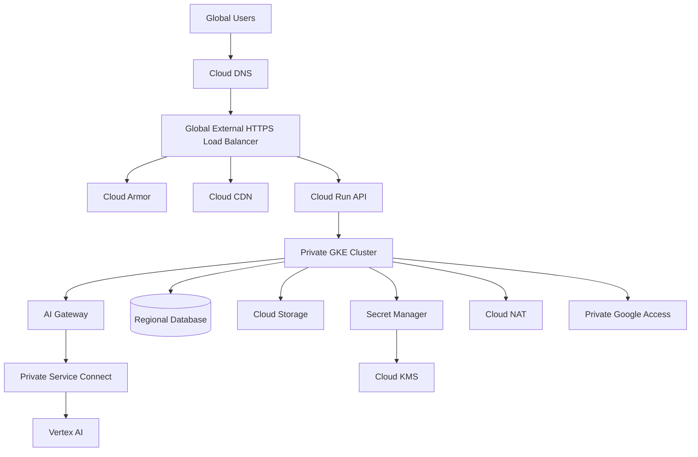
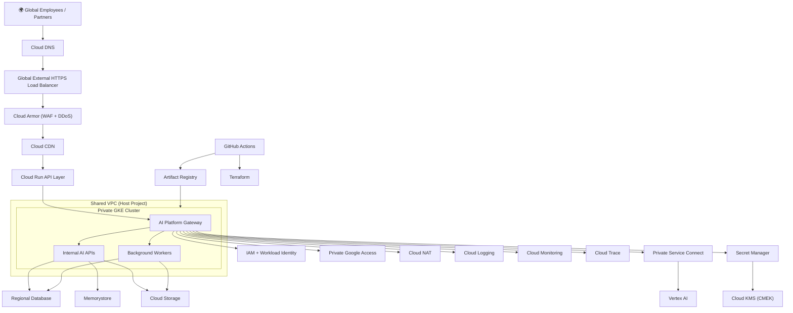
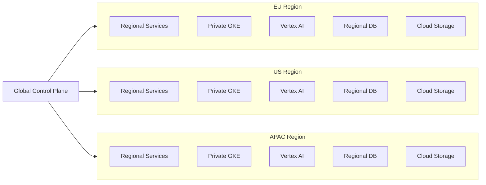

# AR-001 — Global AI Platform Architecture Review

> **Architecture Review Series (AR)**
>
> **Review ID:** AR-001
>
> **Category:** AI Platform
>
> **Difficulty:** ★★★★★ (Principal Architect)
>
> **Target Audience**
>
> - Google Cloud Professional Cloud Architect (PCA)
> - Enterprise Architects
> - Platform Engineers
> - Cloud Architects
> - AI Infrastructure Engineers
>
> **Estimated Reading Time:** 30–45 minutes

---

# Executive Summary

This Architecture Review simulates a real enterprise architecture board meeting for designing a production-grade global AI platform on Google Cloud.

Unlike traditional documentation that explains individual Google Cloud services, this review focuses on **architectural thinking**.

Readers will learn how to:

- Gather requirements before selecting products
- Identify conflicting stakeholder requirements
- Challenge assumptions
- Evaluate trade-offs
- Select appropriate Google Cloud architecture patterns
- Produce production-ready enterprise designs

This document intentionally introduces conflicting business, security, legal, and financial requirements to demonstrate how enterprise architects make decisions when there is no perfect solution.

---

# Scenario Overview

A Fortune 100 company plans to build a centralized AI platform that will serve employees across multiple business units and geographic regions.

The platform will provide:

- Enterprise AI Chat
- Retrieval-Augmented Generation (RAG)
- AI Agents
- Internal Knowledge Search
- Code Assistant
- Model Inference APIs
- Batch AI Processing
- Shared AI Services

The organization expects the platform to become a strategic enterprise capability used by over **50,000 employees worldwide**.

---

# Initial Architecture

```text
                    Employees
                         │
                         ▼
                  Global DNS
                         │
                         ▼
          Global External HTTPS Load Balancer
                         │
              +----------+-----------+
              │                      │
              ▼                      ▼
        Cloud Run API         GKE AI Gateway
              │                      │
              ▼                      ▼
      Vertex AI APIs         Internal AI Services
              │                      │
              └──────────┬───────────┘
                         ▼
                    Cloud SQL
                         │
                         ▼
                   Cloud Storage
```

At first glance the architecture appears reasonable.

However, a production architecture review must evaluate whether it satisfies all business, operational, security, networking, compliance, and reliability requirements.

---

# Business Requirements

## Functional Requirements

The platform must provide:

- Enterprise AI Chat
- Retrieval-Augmented Generation (RAG)
- AI Agents
- Internal APIs
- AI Code Assistant
- Batch AI Processing
- Document Search
- AI Model Inference

---

## Availability Requirements

- 99.99% service availability
- Zero-downtime deployments
- Multi-region resilience
- Automatic failover
- Rolling deployments
- Automatic scaling

---

## Performance Requirements

- AI response time under two seconds
- Global user access
- Edge caching for static assets
- Support document uploads up to 5 GB
- Low latency AI inference

---

## Security Requirements

- No public IP addresses on workloads
- HTTPS only
- Least-Privilege IAM
- Customer-Managed Encryption Keys (CMEK)
- Production workloads isolated from public networks
- Private communication between internal services
- Centralized secrets management
- Comprehensive audit logging

---

## Platform Engineering Requirements

- GitHub Actions CI/CD
- Terraform Infrastructure as Code
- Separate Development, QA, and Production environments
- Shared platform managed by a central engineering team
- Standardized deployment pipeline
- Infrastructure version control

---

## Financial Requirements

The Chief Financial Officer (CFO) has requested:

- Minimal infrastructure duplication
- Centralized shared services
- Reduced operational overhead
- Efficient infrastructure utilization

---

## Compliance Requirements

The compliance office requires:

- Development engineers must never access production databases
- Production access must be fully auditable
- Sensitive data must remain encrypted
- Production environments must be isolated from development

---

## Legal Requirements

During the architecture review meeting, the Legal department introduces an additional requirement:

> European employee data must **never leave the European Union**, while still providing employees with a **single global AI platform experience**.

This requirement fundamentally changes the architecture discussion because it introduces strict data residency constraints that may conflict with centralized global data storage.

---

# Stakeholders

| Stakeholder | Primary Concern |
|--------------|-----------------|
| Chief Executive Officer | Successful enterprise AI adoption |
| Chief Technology Officer | Scalable global platform |
| Chief Information Security Officer | Zero Trust security |
| Chief Financial Officer | Cost optimization |
| Legal Department | GDPR and data residency |
| Compliance Team | Regulatory compliance |
| Platform Engineering | Operational simplicity |
| Application Teams | Fast feature delivery |
| Operations Team | Reliability and monitoring |

---

# Architecture Review Objective

The purpose of this review is **not** to identify the "best" Google Cloud products.

Instead, the objective is to answer a more important question:

> **What architecture best satisfies the organization's business objectives while balancing security, compliance, reliability, operational complexity, and cost?**

This distinction is one of the defining characteristics of enterprise architecture.

The remainder of this document follows the same review process used in architecture review boards within large enterprises.

---

# Architecture Review

The first responsibility of an Enterprise Architect is **not** to recommend Google Cloud services.

The first responsibility is to determine whether sufficient information exists to make an architecture decision.

## Missing Information

Before approving this architecture, the following questions should be answered:

| Area | Questions |
|-------|-----------|
| Users | Where are users located (EU, US, APAC)? |
| Scale | Expected concurrent users and requests per second? |
| AI | Which models will be used? Gemini, open models, or both? |
| Data | Expected database size and growth? |
| Reliability | RPO and RTO requirements? |
| Networking | Hybrid connectivity required? |
| Compliance | Which regulations apply (GDPR, HIPAA, PCI DSS)? |
| Operations | Who owns the platform? |

Without these answers, any proposed architecture carries unnecessary risk.

---

## Stakeholder Conflict Analysis

| Stakeholder | Requirement | Challenge |
|--------------|-------------|-----------|
| CFO | One shared platform | Reduces cost but increases blast radius |
| Security | No public workloads | Increases operational complexity |
| Legal | EU data never leaves EU | Limits global replication |
| Platform Team | Single deployment model | Regional compliance may require different deployments |
| Development | Fast delivery | Security controls may slow releases |

Enterprise architecture is the process of balancing these competing priorities.

---

# Final Proposed Architecture

The recommended architecture follows the pattern:

> **Global Control Plane + Regional Data Planes**

## Architecture Overview



---

## Regional Deployment Model

```text
                    Global Control Plane

 Cloud DNS

 Global HTTPS Load Balancer

 Cloud Armor

 Cloud CDN

 CI/CD

 Terraform

 Monitoring

 IAM

               │

──────────────────────────────────────────────────────────

               │

        Regional Data Planes

 EU Region

 Private GKE

 Regional Database

 Vertex AI

 Cloud Storage

-------------------------

 US Region

 Private GKE

 Regional Database

 Vertex AI

 Cloud Storage

-------------------------

 APAC Region

 Private GKE

 Regional Database

 Vertex AI

 Cloud Storage
```

---

# Architecture Decisions

| Decision | Reason |
|----------|--------|
| Shared VPC | Centralized networking and governance |
| Separate Dev / QA / Prod Projects | Environment isolation |
| Private GKE | No public IPs |
| AI Gateway | Centralized authentication, routing, logging, prompt guardrails |
| Private Service Connect | Private access to Vertex AI |
| Private Google Access | Access Google APIs privately |
| Cloud NAT | Outbound Internet without public IPs |
| Cloud Armor | WAF and DDoS protection |
| Cloud CDN | Global edge caching |
| Regional Databases | Data residency and fault isolation |


## Decision: Introduce an AI Platform Gateway

### Problem

A straightforward implementation would allow application services to invoke Vertex AI directly.

```text
Cloud Run / GKE
        │
        ▼
    Vertex AI
```

While this works for small applications, it becomes difficult to operate at enterprise scale.

As the number of applications, business units, AI models, and compliance requirements grows, direct integration creates duplicated logic, inconsistent security controls, and reduced operational visibility.

---

## Decision

Introduce an **AI Gateway** as the single entry point for all AI requests.

```text
Applications
      │
      ▼
+------------------------+
|       AI Gateway       |
|------------------------|
| Authentication         |
| Authorization          |
| Prompt Validation      |
| Rate Limiting          |
| Model Routing          |
| Cost Controls          |
| Audit Logging          |
| Observability          |
| Response Caching       |
+------------------------+
      │
      ▼
Private Service Connect
      │
      ▼
Vertex AI
```

---

## Why an AI Platform Gateway?

### 1. Centralized Authentication & Authorization

Instead of every application implementing its own security model, the gateway enforces a consistent authentication and authorization policy.

Benefits:

- IAM integration
- Service account validation
- Fine-grained access control
- Business-unit isolation

---

### 2. Model Abstraction

Applications should not know which LLM they are calling.

Today:

- Gemini 2.5

Tomorrow:

- Gemini 3.x
- Open models
- Third-party models
- On-premises models

The gateway hides provider-specific APIs from application teams.

---

### 3. Prompt Guardrails

Every AI request can be validated before reaching the model.

Examples:

- Prompt injection detection
- Sensitive information detection
- PII masking
- Prompt size validation
- Content policy enforcement

This reduces security and compliance risks.

---

### 4. Cost Optimization

The gateway becomes the control point for AI spending.

Examples:

- Token quotas
- Budget enforcement
- Request throttling
- Model selection based on cost
- Caching repeated prompts

Without a gateway, every application would implement these controls differently—or not at all.

---

### 5. Observability

The gateway provides a single place to capture:

- Request latency
- Token usage
- Prompt volume
- Error rates
- Cost per business unit
- Model utilization
- User activity

This enables enterprise-wide monitoring and chargeback.

---

### 6. Future Flexibility

The organization can change AI providers without requiring every application to be rewritten.

Applications continue calling the gateway while the gateway manages integrations with different model providers.

This reduces vendor lock-in and simplifies platform evolution.

---

## Trade-offs

| Benefit | Trade-off |
|----------|-----------|
| Centralized governance | Additional component to operate |
| Consistent security | Slight increase in latency |
| Improved observability | Gateway must be highly available |
| Vendor abstraction | Additional implementation effort |
| Cost optimization | More platform engineering work |

---

## Production Responsibilities of the AI Gateway

The AI Gateway should provide:

- Authentication
- Authorization
- Prompt validation
- Rate limiting
- Request routing
- Model selection
- Token accounting
- Cost tracking
- Request logging
- Response caching (where appropriate)
- Audit logging
- Policy enforcement
- Retry and circuit breaker logic
- API versioning

---

## Architect's Note

The AI Gateway is **not** introduced because Vertex AI lacks functionality.

It is introduced because enterprise platforms require a centralized control layer for governance, security, observability, and lifecycle management.

As organizations adopt multiple AI models and support many application teams, the gateway becomes a strategic platform component rather than an optional optimization.


---

# Production Checklist

## Networking

- Shared VPC
- Private GKE
- Cloud NAT
- Private Google Access
- Private Service Connect
- Regional VPC design

## Security

- Cloud Armor
- IAM Least Privilege
- Workload Identity
- Secret Manager
- CMEK
- Audit Logs

## Reliability

- Multi-region deployment
- Health Checks
- Autoscaling
- Rolling deployments
- Backup strategy

## Operations

- GitHub Actions
- Terraform
- Cloud Monitoring
- Cloud Logging
- Alerting
- SLO dashboards

---

# PCA & Interview Takeaways

## PCA Exam Tips

- Shared VPC is the preferred networking model for large enterprises.
- Cloud Armor and Cloud CDN are features of the Global External HTTPS Load Balancer.
- Private Google Access and Cloud NAT solve different networking problems and are commonly used together.
- Private Service Connect exposes services, not networks.
- Data residency often requires regional data planes rather than globally replicated databases.

---

## Common Interview Questions

1. Why Shared VPC instead of VPC Peering?
2. Why place an AI Gateway in front of Vertex AI?
3. How would you satisfy GDPR while maintaining a global platform?
4. Which stakeholder requirement would you challenge first?
5. How would you reduce operational complexity without compromising security?

---

# Key Lessons

This review highlights several important architectural principles:

- Architecture begins with business requirements—not Google Cloud services.
- Challenge assumptions before proposing solutions.
- A global user experience does not require globally replicated data.
- Security, compliance, cost, and operational simplicity often conflict and require trade-offs.
- Select architecture patterns first, then map them to Google Cloud services.

---

# Final Verdict

**Recommended Architecture Pattern**

> **Global Control Plane + Regional Data Planes**

This architecture provides:

- Global user experience
- Regional data residency
- Centralized governance
- Private networking
- Zero Trust security
- High availability
- Independent regional scalability

It represents a production-ready enterprise architecture suitable for large organizations adopting AI at scale.

---



---



---
Request Flow

User

↓

Cloud DNS

↓

Global HTTPS Load Balancer

↓

Cloud Armor

↓

Cloud CDN

↓

Cloud Run

↓

AI Platform Gateway

↓

Authentication

↓

Authorization

↓

Prompt Guardrails

↓

Model Routing

↓

Private Service Connect

↓

Vertex AI

↓

Regional Database

↓

Cloud Storage

↓

Response

↓

User


