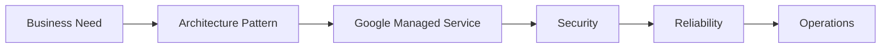

# Enterprise Google Cloud Architecture Documentation in Clear, Practical English

## Purpose

Write architecture documentation that a Cloud Engineer with 2 to 3 years of experience can understand quickly.

The goal is not to sound impressive. The goal is to teach clearly.

Write like a Principal Architect mentoring an engineer in a whiteboard session.

## Writing Rules

- Use simple English.
- Use short sentences.
- Use active voice.
- Explain one idea at a time.
- Prefer bullets and tables over long paragraphs.
- Use real examples.
- Explain the reason behind every decision.
- Prefer Google managed services when they fit the need.
- Explain trade-offs, not just the final answer.

## Words to Avoid

Do not use these words unless you really need them:

- leverage
- utilize
- facilitate
- paradigm
- holistic
- robust
- seamlessly
- comprehensive
- synergy
- best-in-class
- enterprise-grade
- cutting-edge
- revolutionary
- innovative
- state-of-the-art

Use simpler words instead.

Examples:

| Avoid | Write Instead |
| --- | --- |
| Utilize Shared VPC to facilitate centralized governance. | Use Shared VPC so the networking team can manage all networks from one place. |
| Leverage Workload Identity Federation. | Use Workload Identity Federation so GitHub Actions can access Google Cloud without service account keys. |
| Implement observability. | Collect logs, metrics, and traces so engineers can find problems faster. |

## How to Explain a Decision

Every important choice should follow this pattern:

Business problem
↓
Architecture pattern
↓
Google managed service
↓
Security impact
↓
Reliability impact
↓
Cost impact
↓
Operations impact

Do not start with the product.

## What Each Section Should Answer

- What is it?
- Why do we need it?
- When should we use it?
- How does it work?
- Why is it better than other options?
- Which Google managed service should we choose?
- What are the trade-offs?
- What are the common mistakes?
- What does PCA expect on the exam?
- What should a hiring manager ask in an interview?

## Preferred Document Structure

Use this structure for most architecture documents:

1. Executive Summary
2. Business Context
3. Business Requirements
4. Constraints
5. Architecture Decisions
6. Trade-offs
7. Recommended Architecture
8. Security Considerations
9. Reliability Considerations
10. Cost Considerations
11. Operations Considerations
12. Common Mistakes
13. PCA Exam Tips
14. Interview Tips
15. Key Lessons Learned

## Use Real Scenarios

Use examples like these:

- Banking platform
- Healthcare platform
- Retail application
- AI chatbot
- Enterprise migration
- Internal developer platform
- SaaS platform

Example:

Requirement: 300 Google Cloud projects

Question: How should networking be managed?

Answer: Use Shared VPC.

Reason: The networking team manages one network while application teams keep control of their own projects.

## Tables to Prefer

Use tables when comparing services or decisions.

Example:

| Requirement | Recommended Service | Why |
| --- | --- | --- |
| Global SQL | Spanner | Strong consistency with multi-region design |
| PostgreSQL | Cloud SQL | Simple managed PostgreSQL |
| High-performance PostgreSQL | AlloyDB | Better performance and scale |

## Diagram Rules

- Use simple Mermaid diagrams.
- Keep labels short.
- Show the main flow only.
- Avoid crowded diagrams.
- Use diagrams when architecture or decision flow is discussed.

Example:

## Good Paragraph Style

Keep paragraphs short.

- One idea per paragraph.
- Four to five lines maximum.
- Use a paragraph only when a bullet does not fit.

## Example of Good Explanation

Business need: the company wants secure CI/CD without storing service account keys.

Decision: use Workload Identity Federation.

Why: the CI system can authenticate to Google Cloud with short-lived credentials.

Why not service account keys: keys are hard to rotate and easy to leak.

Trade-off: setup takes more time at the start, but the security model is much better.

## Example of Good Comparison

| Option | Best Use | Trade-off |
| --- | --- | --- |
| Cloud Run | Stateless HTTP services | Less control than GKE |
| GKE | Complex container platforms | More operational work |
| Managed Instance Groups | VM-based legacy apps | Less cloud-native |
| Compute Engine | Special workloads and legacy needs | Highest admin effort |

## PCA and Interview Tips

- Explain why the managed service is the best fit.
- Mention the trade-off of the chosen option.
- Call out when a different service is better.
- Tie the answer back to security, reliability, and operations.
- Show that you can think like an architect, not just name products.

## Final Quality Check

Before publishing, check the document against this list:

- Is the English simple?
- Can a Cloud Engineer understand it?
- Does every architecture decision include a reason?
- Are Google managed services preferred?
- Are trade-offs explained?
- Are diagrams included?
- Are examples included?
- Are interview tips included?
- Are PCA exam tips included?
- Is the document practical rather than theoretical?

## Key Lesson

Good architecture writing makes complex decisions easy to follow.

The best document is clear, practical, and useful in real work.