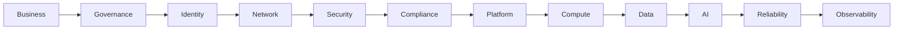
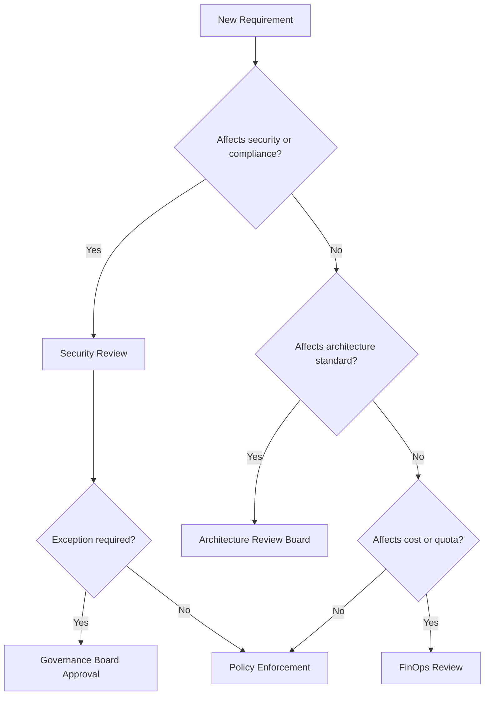
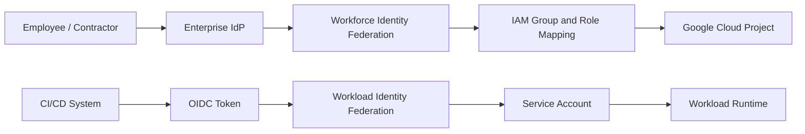
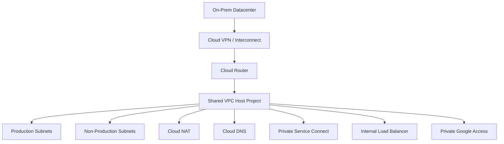
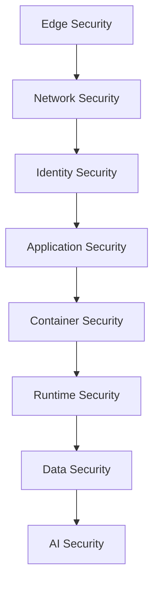
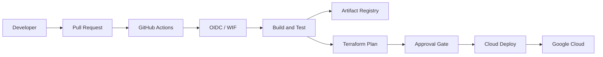
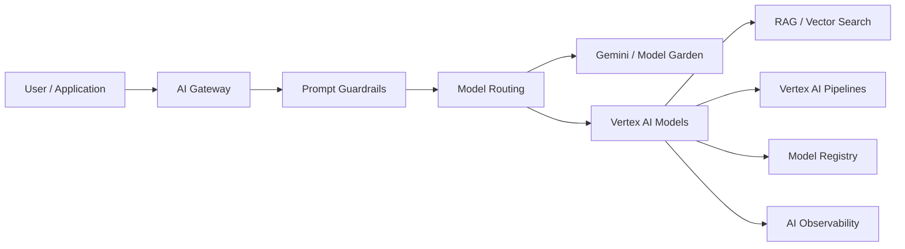
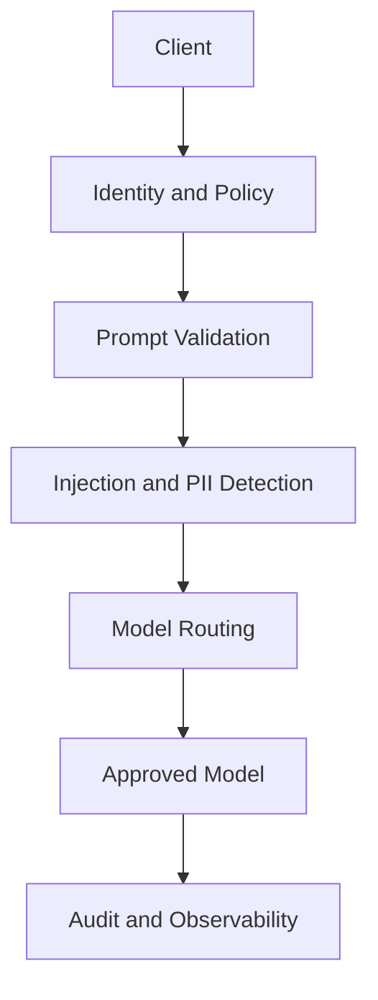
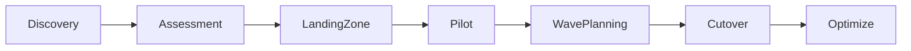
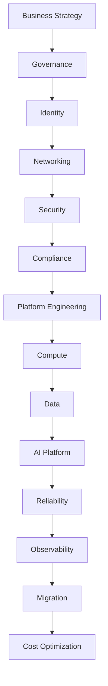

# Enterprise Governance, Security & Compliance Strategy for Google Cloud

## Executive Summary

This document describes how a large enterprise should design governance, security, compliance, reliability, platform engineering, and operational strategy on Google Cloud. The intent is not to document products in isolation, but to define a Principal Architect operating model that makes cloud adoption safe, auditable, scalable, and repeatable.

The recommended approach follows Google's managed-service-first philosophy. That means using Google Cloud control planes, policy controls, identity federation, managed networking patterns, and platform automation before introducing custom operational complexity. The result should be a cloud foundation that can support migration, cloud-native delivery, and AI platform growth without creating unnecessary governance debt.

## 1. Business Strategy

Business strategy defines why the program exists and what success means.

### Business Objectives

- Reduce enterprise risk while accelerating cloud adoption.
- Improve security posture and compliance evidence quality.
- Standardize delivery through a governed platform model.
- Enable product teams to deploy faster with fewer approvals.
- Establish a foundation for AI, data, and hybrid modernization.

### Business Drivers

- Regulatory and audit pressure.
- Cost transparency and optimization.
- Faster time to market.
- Resilience and disaster recovery improvement.
- Reduction of operational toil and tool sprawl.

### Functional Requirements

- Centralized identity and access control.
- Controlled network segmentation and private connectivity.
- Repeatable project and environment provisioning.
- Auditable deployment and change workflows.
- Standardized logging, monitoring, and incident response.

### Non-functional Requirements

- Availability and recovery targets by application tier.
- Encryption and access control for sensitive data.
- Auditability and evidence retention.
- Automation for scale and consistency.
- Cost governance and accountability.

### Stakeholders

| Stakeholder | Concern | Decision Scope |
| --- | --- | --- |
| CIO | Business value, pace, cost | Program sponsorship |
| CISO | Risk, controls, compliance | Security policy and exception approval |
| CTO / Platform Lead | Delivery velocity, architecture standards | Platform direction |
| Finance / FinOps | Budget, chargeback, optimization | Cost governance |
| Legal / Privacy | Residency, sovereignty, retention | Compliance interpretation |
| Application Owners | Availability, release safety | Workload readiness |

### Success Criteria

- Clear governance model and decision rights.
- Standardized landing zone and platform blueprint.
- Measurable reduction in manual access, change, and deployment toil.
- Evidence-ready logging, audit, and compliance controls.
- Migration and platform workstreams aligned to business priorities.

### Business Risks

- Shadow IT and uncontrolled project creation.
- Inconsistent security controls across business units.
- Cost overruns due to lack of budgets and labels.
- Delayed delivery because of unclear approval paths.
- Compliance gaps caused by weak evidence collection.

### Cost Objectives

- Make spend visible by org, folder, project, app, and environment.
- Use budgets and alerts as control mechanisms, not just reporting tools.
- Drive accountability through labels, tags, and showback.
- Reduce waste through rightsizing, autoscaling, and lifecycle policies.

## 2. Governance Strategy

Governance is the control framework that keeps cloud scale safe.

### Organization Governance

**Organization**

Use a single Google Cloud organization as the top-level control boundary for identity, policy, and billing governance.

**Folder Hierarchy**

Use folders to separate shared services, platform teams, business units, and environments.

**Projects**

Use projects as the primary isolation boundary for workloads, shared services, and security functions.

**Shared Services**

Centralize networking, security, logging, CI/CD, and identity integration in shared services projects.

**Environment Separation**

Separate production, non-production, sandbox, and regulated workloads into distinct folders and projects.

**Labels**

Require labels such as owner, app, environment, cost center, data classification, and service tier.

**Tags**

Use tags for policy-driven classification, especially for data sensitivity, residency, and workload class.

**Naming Standards**

Enforce naming patterns for organization units, projects, networks, service accounts, and resources.

**Billing Strategy**

Assign billing accounts by enterprise domain or region only when required; otherwise keep billing centralized and use labels and budgets for visibility.

### Cloud Governance

**Organization Policies**

Use organization policies to enforce security guardrails such as restricted sharing, allowed regions, no external IPs where appropriate, and controlled service account usage.

**Policy as Code**

Store policies in version control, review them through code review, and test them before rollout.

**Resource Lifecycle**

Require owner, purpose, and expiration for temporary environments and non-production assets.

**Resource Ownership**

Every resource must have a named business and technical owner.

**Cost Governance**

Tie budgets, labels, and approvals to business domains.

**Quotas**

Use quotas to prevent accidental overprovisioning and limit blast radius.

**Budgets**

Create budgets per production project and alert at defined thresholds.

**Architecture Review Board**

Use the ARB to approve material design choices, exceptions, and deviations from standards.

**Cloud Governance Board**

Use the governance board to set standards, policy direction, and exception management.

### Governance Decision Tree

### Production Recommendations

- Standardize project factories and landing zone templates.
- Enforce labels, budgets, and policy controls at creation time.
- Use folder and project boundaries to reduce blast radius.
- Require all exceptions to be time bound, documented, and reviewed.

## 3. Identity Strategy

Identity is the first security control plane in Google Cloud.

### Core Capabilities

- **IAM** for access control.
- **Least Privilege** through scoped roles and separation of duties.
- **Custom Roles** only when predefined roles are too broad or too narrow.
- **IAM Conditions** for time, resource, and context-bound access.
- **Google Groups** as the primary identity assignment layer.
- **Workforce Identity Federation** for external workforce access without static passwords.
- **Workload Identity Federation** for keyless CI/CD and external workloads.
- **Workload Identity** for GKE and application identity.
- **Service Account Governance** to prevent sprawl and key abuse.
- **Just-In-Time Access** for privileged operations.
- **Break Glass Access** for controlled emergency response.

### Identity Principles

- Grant access to groups, not individuals.
- Remove long-lived service account keys.
- Treat privileged access as temporary and reviewable.
- Use conditional access for sensitive resources.
- Separate human, machine, and partner access paths.

### Identity Flow

### Production Recommendations

- Use organization-level identity federation early.
- Make service account keys a prohibited pattern.
- Create a privileged access path with logging and approvals.
- Review custom roles quarterly.

## 4. Networking Strategy

Networking should be centralized, private by default, and designed for hybrid enterprise reality.

### Capabilities and Trade-offs

**Shared VPC**

Use Shared VPC when central network control, segmentation, and consistent hybrid routing are required. This is the standard enterprise pattern.

**VPC Peering**

Use VPC peering for limited network adjacency needs, but avoid it as a primary enterprise hub model.

**Private Service Connect**

Use PSC to consume managed services privately and avoid public exposure.

**Private Google Access**

Enable PGA for private access to Google APIs and managed services without external IPs.

**Cloud NAT**

Use NAT for controlled egress from private workloads.

**Cloud Router**

Use Cloud Router for dynamic route exchange with on-premises networks.

**Cloud DNS**

Use Cloud DNS for enterprise DNS resolution, split-horizon patterns, and private zones.

**Cloud VPN**

Use VPN for initial hybrid connectivity or smaller bandwidth needs.

**Partner Interconnect**

Use partner connectivity when enterprise-grade dedicated links are required through a partner.

**Dedicated Interconnect**

Use dedicated circuits when throughput, latency, and resiliency justify the cost.

**Global External HTTPS Load Balancer**

Use the global LB for internet-facing applications with global reach and centralized security controls.

**Regional Load Balancers**

Use regional load balancing for locality-sensitive services or internal application tiers.

**Cloud Armor**

Use Cloud Armor for WAF, rate limiting, and DDoS protection.

**Cloud CDN**

Use CDN for cacheable content and edge delivery.

### Shared VPC Architecture

### Networking Trade-off Guide

| Service | Best Use | Trade-off |
| --- | --- | --- |
| Shared VPC | Enterprise standard network hub | More central control, more governance |
| VPC Peering | Simple one-to-one connectivity | Scales poorly as a hub model |
| PSC | Private service consumption | Requires service support and design discipline |
| VPN | Fast initial hybrid setup | Lower bandwidth and less deterministic latency |
| Partner Interconnect | Enterprise connectivity via partner | Less control than dedicated circuits |
| Dedicated Interconnect | High-throughput, resilient hybrid link | Higher cost and provisioning complexity |

## 5. Security Strategy

Security is organized by threat surface and control domain.

### Identity Security

- Zero Trust access assumptions.
- IAM groups and least privilege.
- Workforce and workload federation.
- Just-in-time and break-glass access.
- Service account lifecycle governance.

### Network Security

- Shared VPC segmentation.
- Private networking by default.
- Cloud Armor at the edge.
- VPC Service Controls for sensitive perimeters.
- Cloud IDS where packet inspection is required and supported by architecture.

### Application Security

- Secure-by-default APIs.
- Secret Manager for runtime secrets.
- Input validation and abuse controls.
- Centralized vulnerability scanning.
- Policy-controlled release gates.

### Container Security

- Artifact Registry as trusted artifact store.
- Binary Authorization for deploy admission.
- Image scanning and provenance controls.
- Minimal base images and signed builds.

### Runtime Security

- Least privilege runtime service accounts.
- Workload identity instead of keys.
- Runtime logging and anomaly detection.
- Hardened service ingress and egress policies.

### Infrastructure Security

- Organization policies.
- Configuration drift detection.
- KMS and CMEK.
- Patch and vulnerability management.
- Controlled admin access.

### Data Security

- Data classification.
- Encryption in transit and at rest.
- CMEK for sensitive data.
- DLP controls for regulated content.
- Retention and deletion policies.

### Secrets Management

- Secret Manager for application and platform secrets.
- No secrets in code or images.
- Rotation and access review.

### Encryption

- Use Google-managed encryption by default.
- Use CMEK when control or regulation requires customer-managed keys.
- Use HSM-backed KMS keys for the highest assurance use cases.

### Threat Detection

- Security Command Center as the posture and findings hub.
- Vulnerability Management for cloud assets.
- Cloud IDS where network threat visibility is required.

### Logging & Audit

- Cloud Audit Logs for admin, access, and data events.
- Retention policies aligned to compliance obligations.
- Centralized logging with restricted access.

### AI Security

- Prompt guardrails for safe generation and tool use.
- AI Gateway for policy, routing, and control.
- Prompt injection detection for model-facing interfaces.
- PII detection and masking in prompts and outputs.
- AI governance for model approval, usage policy, and auditability.

### Security Layers Diagram

### Security Recommendations

- Make security reviews part of design, not the final gate.
- Use policy and automation to reduce human exception handling.
- Centralize sensitive logging and key management.
- Treat AI interfaces as security-sensitive application entry points.

## 6. Compliance Strategy

Compliance is the structured evidence of control, not a spreadsheet exercise.

### Frameworks

- PCI DSS for payment data environments.
- HIPAA for healthcare-regulated data and workloads.
- GDPR for personal data protection and processing controls.
- SOC 2 for trust service criteria evidence.
- ISO 27001 for information security management controls.
- SOX for financial reporting and change control.

### Compliance Design Topics

- **Data Residency**: keep data in approved regions where required.
- **Data Sovereignty**: define which jurisdictions and administrators can access regulated data.
- **Audit Requirements**: ensure logs, change history, and approvals are retained.
- **Encryption**: define standard, CMEK, and HSM use cases.
- **Key Management**: control rotation, access, and separation of duties.
- **Log Retention**: align retention to legal and regulatory needs.
- **Risk Management**: track exceptions, compensating controls, and remediation dates.
- **Evidence Collection**: automate evidence where possible.

### Compliance Checklist

| Area | Requirement |
| --- | --- |
| PCI DSS | Isolate cardholder data, restrict access, log activity |
| HIPAA | Protect PHI, audit access, control disclosures |
| GDPR | Minimize personal data, support deletion and access rights |
| SOC 2 | Demonstrate control design and operating effectiveness |
| ISO 27001 | Maintain policy, risk, and control evidence |
| SOX | Preserve change control and access segregation |

### Compliance Recommendations

- Map every regulatory control to a cloud mechanism and an evidence owner.
- Automate evidence collection from logs, policies, and CI/CD.
- Use data classification and tagging early.
- Treat residency, encryption, and auditability as architecture decisions.

## 7. Platform Engineering Strategy

Platform engineering turns governance into a reusable service.

### Core Capabilities

- GitHub Actions for CI.
- OIDC and Workload Identity Federation for keyless authentication.
- Cloud Build for managed build execution.
- Cloud Deploy for delivery governance.
- Artifact Registry for artifact promotion.
- Terraform for infrastructure as code.
- GitOps for declarative environment control.
- Golden Paths for approved workload patterns.
- Shared Modules and Platform Templates for consistency.
- Promotion Governance and rollback standards.

### CI/CD Platform Diagram

### Platform Recommendations

- Standardize one delivery path per workload class.
- Store IaC state remotely and version all modules.
- Require promotion approvals for production changes.
- Use templates for project creation, services, and environments.
- Keep rollback strategies documented and testable.

## 8. Compute Strategy

Use managed compute options first, then choose the smallest operational burden that fits the workload.

| Option | Best Use | Trade-off |
| --- | --- | --- |
| Cloud Run | Stateless HTTP services, APIs, event handlers | Limited low-level control, ideal operational simplicity |
| GKE | Complex container platforms, service mesh, advanced orchestration | Highest operational complexity, strongest control |
| Managed Instance Groups | Lift-and-shift VMs, legacy apps, autoscaled VM fleets | Still VM-centric, more ops than container platforms |
| Compute Engine | Specialized workloads, custom OS or drivers, legacy dependencies | Maximum control, maximum operational burden |
| App Engine | Simple web apps with standard runtime fit | Framework constraints, less architectural flexibility |
| Cloud Functions | Small event-driven units and glue logic | Not ideal for larger service surfaces or complex orchestration |

### Compute Decision Framework

1. Prefer Cloud Run for stateless services.
2. Choose GKE when platform complexity is justified by orchestration needs.
3. Use MIGs for transitional or legacy VM workloads.
4. Use Compute Engine only when custom control is essential.
5. Use App Engine and Cloud Functions when the workload shape strongly matches them.

## 9. Data Strategy

Select the database and storage service based on workload semantics, not familiarity.

| Service | Best Use |
| --- | --- |
| Cloud SQL | Standard relational workloads, including PostgreSQL migration targets |
| AlloyDB | High-performance PostgreSQL-compatible enterprise workloads |
| Spanner | Global scale, strong consistency, mission-critical relational systems |
| BigQuery | Analytics, reporting, and large-scale SQL analytics |
| Bigtable | Wide-column, low-latency, high-throughput workloads |
| Firestore | Document and application state workloads |
| Memorystore | Caching and ephemeral state |
| Cloud Storage | Object storage, backups, archives, and landing zones |

### Data Operations

- Use Cloud Storage lifecycle policies for retention and archival.
- Enable versioning where rollback or immutability is required.
- Define backup and restore objectives per system class.
- Use managed replication and DR patterns for critical databases.

## 10. AI Platform Strategy

Use Google managed AI services wherever practical to reduce operational risk and accelerate time to value.

### Core Capabilities

- Vertex AI for model hosting, orchestration, and managed AI workflows.
- Gemini for foundation-model use cases.
- Model Garden for model selection and reuse.
- Vertex AI Pipelines for repeatable ML workflows.
- Model Registry for versioned model governance.
- Feature Store for consistent feature reuse.
- Vector Search for retrieval and semantic matching.
- RAG for grounded generation.
- Agent Development Kit (ADK) for agent orchestration patterns.
- Vertex AI Search for enterprise search experiences.
- AI Platform Gateway for controlled access and routing.
- Prompt Guardrails for policy enforcement.
- Model Routing for workload optimization and fallback.
- Cost Management for spend control.
- AI Governance and AI Observability for operational assurance.

### AI Platform Architecture

### AI Gateway

### AI Recommendations

- Treat prompts, tools, and model access as governed enterprise assets.
- Use RAG for grounded answers when enterprise data matters.
- Enforce guardrails before and after model invocation.
- Measure quality, safety, latency, and cost together.

## 11. Reliability Strategy

Reliability must be engineered at every layer.

### Required Capabilities

- High Availability.
- Multi-Zone deployment.
- Multi-Region architecture where justified.
- Health Checks at infrastructure and application layers.
- Autoscaling based on real demand.
- Blue/Green and Canary release patterns.
- Backup and Disaster Recovery.
- Chaos Engineering for resilience validation.
- RPO, RTO, SLI, SLO, and Error Budgets.

### Reliability Checklist

| Item | Target |
| --- | --- |
| HA | Multi-zone by default for production |
| DR | Tested restore and failover procedures |
| Health Checks | Readiness, liveness, dependency, and synthetic checks |
| Autoscaling | Configured to workload profile |
| Blue/Green | Available for high-risk cutovers |
| Canary | Required for controlled production releases |
| RPO | Defined by application tier |
| RTO | Defined by application tier |
| SLO | Measured and reviewed regularly |
| Error Budget | Drives release governance |

## 12. Observability Strategy

Observability connects architecture intent to operational reality.

### Core Capabilities

- Cloud Logging for centralized logs.
- Cloud Monitoring for dashboards and alerting.
- Cloud Trace for latency analysis.
- Metrics for golden signals and business KPIs.
- Distributed tracing for cross-service visibility.
- Incident management workflows.
- Runbooks and operational dashboards.
- Cost dashboards for accountability.

### Observability Recommendations

- Standardize log schemas and correlation IDs.
- Tie alerts to SLOs, not raw noise.
- Build dashboards for executives, operators, and cost owners.
- Keep runbooks close to the metrics they explain.

## 13. AI SRE Strategy

AI workloads should be treated as production workloads with production controls.

### Metrics to Track

- Infrastructure Metrics.
- Application Metrics.
- AI Metrics.
- GPU Utilization.
- Token Usage.
- Prompt Latency.
- Model Latency.
- Cost per Request.
- Cost per Tenant.
- Hallucination Rate.
- Groundedness.
- Safety Score.
- Prompt Injection Detection.
- Cache Hit Ratio.
- AI Error Budget.
- Model Quality Regression.
- AI Incident Response.

### AI SRE Checklist

| Category | Required Control |
| --- | --- |
| Infrastructure | Capacity, availability, and GPU monitoring |
| Application | Latency, error rate, and dependency health |
| AI | Safety, groundedness, quality regression, and cost |
| Security | Prompt injection detection and data controls |
| Operations | Runbooks, on-call, and incident review |

## 14. Migration Strategy

Migration succeeds when assessment comes before execution.

### Core Phases

- Migration Center as the inventory and planning entry point.
- Discovery across VMware, databases, storage, identity, and network.
- Dependency mapping to uncover application coupling.
- Landing zone and shared services readiness.
- Identity and networking foundation.
- Pilot migration to validate patterns.
- Wave planning for repeatability.
- Validation and cutover discipline.
- Optimization after landing.

### Migration Phases Diagram

### Migration Recommendations

- Do not migrate what you cannot inventory and validate.
- Pilot low-risk workloads first.
- Use migration waves based on dependency and business risk.
- Validate connectivity, identity, observability, and rollback before cutover.

## 15. Cost Optimization Strategy

Cost control is a governance capability, not a finance afterthought.

### Core Controls

- Budgets and alerts.
- Labels and tags.
- Rightsizing.
- Autoscaling.
- Spot VMs where appropriate.
- Committed Use Discounts.
- Lifecycle policies.
- Storage optimization.
- AI cost monitoring.
- Chargeback and showback.

### Cost Recommendations

- Make cost ownership visible at the project and application level.
- Use lifecycle policies for logs, backups, and archives.
- Optimize storage tiering early.
- Build AI budgets before broad adoption.

## 16. Enterprise Architecture Review Checklist

Use the following checklist before approving production design or major platform changes.

### Governance Checklist

| Question | Yes / No |
| --- | --- |
| Is the organization hierarchy defined? |  |
| Are folders and projects aligned to ownership? |  |
| Are labels, tags, and budgets enforced? |  |
| Is policy as code in place? |  |
| Is the ARB or governance board active? |  |

### Security Checklist

| Question | Yes / No |
| --- | --- |
| Is least privilege enforced? |  |
| Are keys eliminated in favor of federation? |  |
| Are secrets in Secret Manager? |  |
| Are logs and audit trails retained? |  |
| Are security findings actively managed? |  |

### Compliance Checklist

| Question | Yes / No |
| --- | --- |
| Are residency and sovereignty requirements identified? |  |
| Are encryption and key management requirements mapped? |  |
| Are log retention requirements met? |  |
| Is evidence collection automated? |  |
| Are exceptions tracked and time bound? |  |

### Reliability Checklist

| Question | Yes / No |
| --- | --- |
| Are HA and DR targets defined? |  |
| Are RPO and RTO documented? |  |
| Are health checks and autoscaling configured? |  |
| Are blue/green or canary options ready? |  |
| Are SLOs and error budgets in place? |  |

### Platform Engineering Checklist

| Question | Yes / No |
| --- | --- |
| Are CI/CD and IaC standards published? |  |
| Are modules versioned and reusable? |  |
| Is promotion governance defined? |  |
| Is rollback tested? |  |
| Is artifact and state management centralized? |  |

### AI SRE Checklist

| Question | Yes / No |
| --- | --- |
| Are AI metrics captured? |  |
| Are prompt guardrails enforced? |  |
| Are model quality regressions tracked? |  |
| Are cost and safety monitored together? |  |
| Is incident response defined for AI systems? |  |

### Migration Readiness Checklist

| Question | Yes / No |
| --- | --- |
| Is the current state discovered? |  |
| Are dependencies mapped? |  |
| Is the landing zone ready? |  |
| Are identity and networking approved? |  |
| Is the pilot validated? |  |

### Architecture Review Checklist

| Pillar | Required Review |
| --- | --- |
| Business Strategy | objectives, drivers, risks, cost |
| Governance Strategy | structure, policy, ownership, approvals |
| Identity Strategy | IAM, federation, privileged access |
| Networking Strategy | hybrid, private connectivity, edge controls |
| Security Strategy | controls, detection, encryption, AI security |
| Compliance Strategy | frameworks, evidence, retention, residency |
| Platform Engineering Strategy | delivery, templates, promotion, rollback |
| Compute Strategy | service fit, trade-offs, managed-first choice |
| Data Strategy | storage, relational, analytical, backup |
| AI Platform Strategy | model governance, guardrails, routing |
| Reliability Strategy | HA, DR, SLO, error budgets |
| Observability Strategy | metrics, logs, traces, incident response |
| AI SRE Strategy | safety, quality, latency, cost, response |
| Migration Strategy | discovery, waves, validation, cutover |
| Cost Optimization Strategy | budgets, lifecycle, showback, optimization |

## Enterprise Architecture Framework

## Common Mistakes to Avoid

- Treating governance as bureaucracy instead of risk control.
- Allowing individual IAM grants to proliferate.
- Building a custom platform before establishing landing zone standards.
- Using public connectivity when private access is available.
- Underestimating compliance evidence and audit retention needs.
- Ignoring AI governance and treating prompts as ungoverned text.
- Measuring success by service count rather than operating model maturity.

## Production Readiness Checklist

- The landing zone is approved and implemented.
- Identity federation is operational.
- Shared VPC and hybrid connectivity are tested.
- Security controls are mapped to threats and compliance obligations.
- CI/CD and IaC patterns are standardized.
- Observability and audit logging are centralized.
- Reliability objectives are measurable.
- AI workloads have dedicated safety and governance controls.
- Migration, cost, and exception governance are active.

## Key Lessons Learned

- Enterprise cloud success depends on operating model design as much as technical design.
- Managed services should be the default unless a specific requirement proves otherwise.
- Governance, security, and compliance must be designed as code and enforced through automation.
- AI introduces a new control plane, not just a new workload type.
- The architecture that scales is the one that reduces exceptions over time.