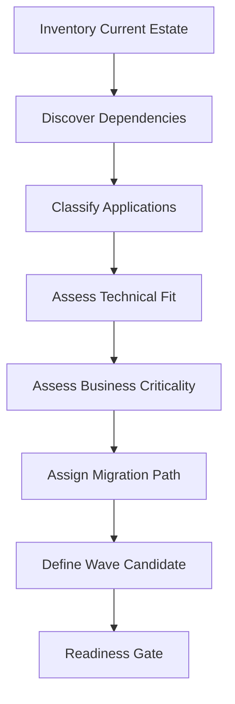
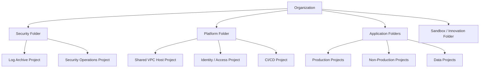
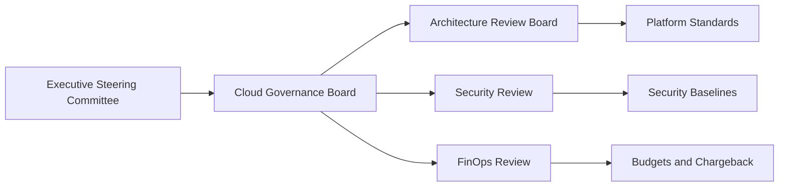
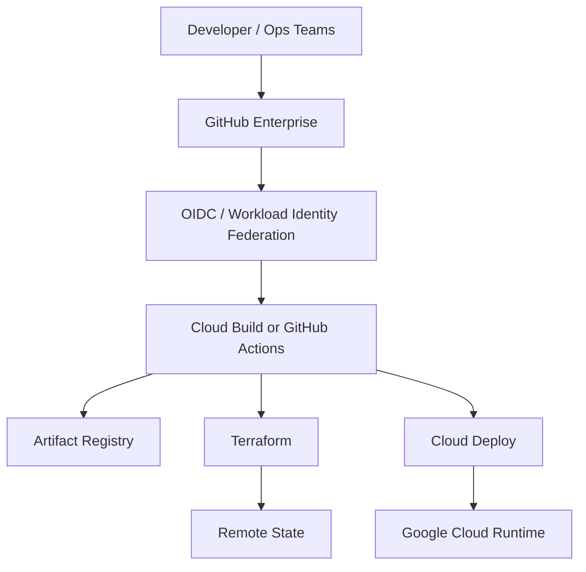
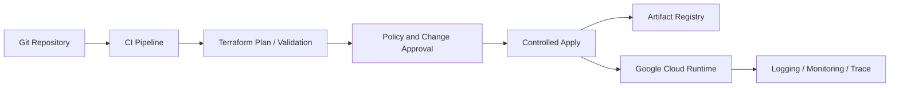
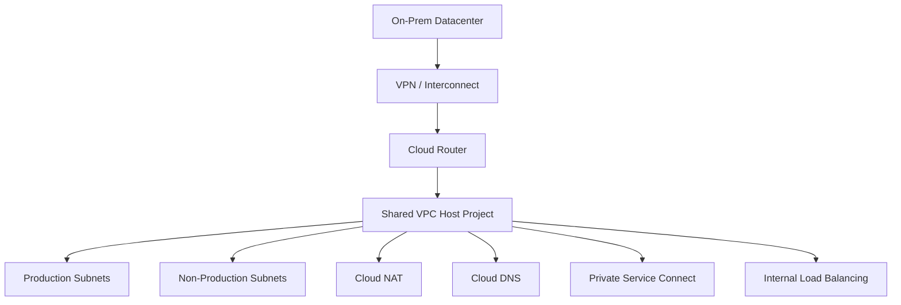
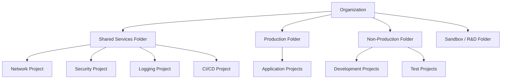
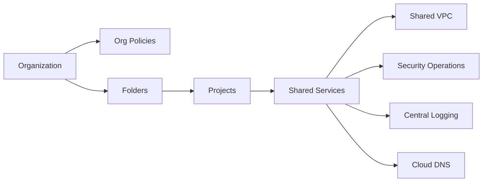
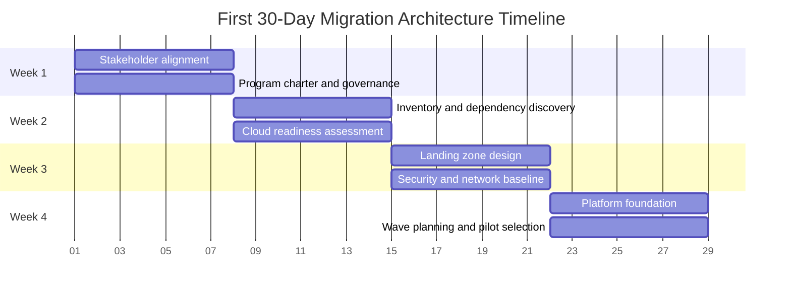

# Enterprise Google Cloud Migration Strategy - First 30 Days

## Executive Summary

The first 30 days of a large-scale Google Cloud migration are not about moving workloads. They are about creating the operating model, governance, security posture, and platform foundation that make a 12-month migration program safe, repeatable, and measurable.

As the Lead Google Cloud Architect, my job in month one is to reduce ambiguity and establish control. That means aligning the business on outcomes, understanding the current estate, defining the landing zone, standing up governance, creating security and networking guardrails, and building the migration planning machinery before any production cutover is attempted.

For a Fortune 500 enterprise with 450 VMware VMs, 25 PostgreSQL databases, 300 TB of storage, Jenkins, GitHub Enterprise, Active Directory, F5, Prometheus, Grafana, and on-prem data centers, the right first move is an organizational transformation backed by Google Cloud managed services. The architecture choice is not "lift workloads first". It is "design the control plane first".

## Business Objectives

The CIO's question is about transformation readiness, not technical hand-waving. The business objectives for the first 30 days are:

- Establish executive alignment on scope, decision rights, and success criteria.
- Reduce migration risk by creating a governed landing zone and a clear operating model.
- Classify the current estate into migration paths, dependencies, and business criticality.
- Build a secure, networked, and auditable foundation for future waves.
- Stand up platform engineering practices that make migration repeatable instead of artisanal.
- Create a realistic wave plan with pilots, validation gates, and cutover discipline.

## Migration Guiding Principles

1. Start with business outcomes, not services.
2. Design the landing zone before moving workloads.
3. Prefer Google managed services over self-managed infrastructure when requirements permit.
4. Make governance lightweight but non-negotiable.
5. Treat security and networking as platform capabilities, not project afterthoughts.
6. Use policy as code and infrastructure as code for repeatability.
7. Classify applications before selecting migration strategies.
8. Migrate in waves with explicit readiness and rollback criteria.
9. Validate every design decision against availability, security, operability, and cost.
10. Build for operational handoff from day one.

## First 30 Days Overview

The month is divided into four focused phases:

| Week | Primary Outcome | Main Output |
| --- | --- | --- |
| Week 1 | Align the enterprise | Stakeholder map, program charter, governance cadence, decision log |
| Week 2 | Understand the current state | Application inventory, dependency map, cloud readiness assessment, risk register |
| Week 3 | Define the control plane | Landing zone, organization hierarchy, security baseline, network design |
| Week 4 | Prepare execution | Platform foundation, IaC standards, migration waves, pilot shortlist, KPI baseline |

## Week 1 - Business Discovery & Stakeholder Alignment

Week 1 is about establishing authority, visibility, and shared language. If this step is skipped, every later architecture decision becomes political.

### Objectives

- Confirm the migration vision, scope, budget guardrails, and non-goals.
- Identify decision makers and escalation paths.
- Establish the migration governance forums.
- Define the enterprise architecture principles for the program.
- Agree on risk tolerance, compliance boundaries, and target operating model.

### Activities

- Run executive discovery sessions with CIO, CISO, infrastructure leadership, application owners, network leadership, and finance.
- Define what "success" means for the first 30 days and for the 12-month program.
- Capture constraints such as regulatory obligations, data residency, change windows, licensing, and critical business events.
- Establish program artifacts: charter, RAID log, architecture decision record process, and decision authority matrix.
- Confirm which workloads are in scope for assessment, pilot, and early waves.

### Stakeholder Matrix

| Stakeholder | Primary Concern | Decision Rights | Cadence |
| --- | --- | --- | --- |
| CIO | Business value, pace, cost | Program sponsor, scope approval | Weekly steering |
| CISO | Security, risk, compliance | Security guardrails, exception approval | Weekly security review |
| CTO / Head of Engineering | Delivery velocity, developer experience | Platform direction, engineering standards | Weekly design sync |
| Infrastructure Lead | Network, datacenter, operations | Connectivity, decommission planning | Twice weekly |
| Application Owners | Availability, dependencies, release safety | App-specific readiness and cutover | Per-wave |
| Finance / FinOps | Run-rate, budget, commitment planning | Cost model approval | Weekly review |

### Week 1 Deliverables

- Migration program charter
- Stakeholder map and RACI
- Governance calendar
- Risk and issue log
- Decision log template
- Initial communication plan

## Week 2 - Current State Assessment & Cloud Readiness

Week 2 produces the factual baseline. A migration plan without a credible inventory is opinion, not architecture.

### Objectives

- Inventory applications, infrastructure, data, and operational dependencies.
- Classify workloads by criticality, complexity, and migration suitability.
- Establish dependency discovery using tools and interviews.
- Measure cloud readiness gaps across people, process, technology, security, and operations.
- Identify quick wins and blockers.

### Activities

- Use Migration Center as the core discovery and planning system.
- Pull VMware inventory, CMDB data, monitoring data, firewall rules, and DNS records.
- Map application dependencies across compute, database, storage, identity, and network.
- Classify each workload into categories such as rehost, replatform, refactor, retain, retire, or replace.
- Assess PostgreSQL estates for version, size, HA needs, replication, extensions, and downtime tolerance.
- Review operational maturity for CI/CD, IaC, observability, and incident response.

### Migration Readiness Flow

### Application Classification

| Class | What It Means | Typical Decision |
| --- | --- | --- |
| Rehost | Move with minimal change | Good for low-risk VMware estates |
| Replatform | Small changes to use managed services | Common for PostgreSQL and stateless apps |
| Refactor | Modernize significantly | Use when business value justifies engineering effort |
| Retain | Keep on-prem for now | Used when dependencies or risk are too high |
| Retire | Decommission | Remove dead or duplicated systems |
| Replace | Adopt SaaS or cloud-native alternative | Often best for commodity functions |

### Week 2 Deliverables

- Application and infrastructure inventory
- Dependency map
- Cloud readiness assessment
- Data classification summary
- Application migration candidate list
- Initial risk register with blockers

## Week 3 - Landing Zone, Governance & Security Foundation

Week 3 defines the control plane. This is where enterprise trust is built.

### Objectives

- Create the enterprise landing zone architecture.
- Define organization hierarchy, folder model, project strategy, and shared services.
- Establish governance, policy, and security baselines.
- Design the network landing zone for hybrid connectivity and segmentation.
- Define identity boundaries and privileged access patterns.

### Enterprise Landing Zone

### Governance Model

### Governance Scope

- Organization
- Folder hierarchy
- Projects
- Shared services
- Labels and tags
- Budgets and billing controls
- Organization policies
- Policy as code
- Architecture Review Board
- Cloud Governance Board

### Security Baseline Scope

- Least privilege IAM
- IAM groups and role separation
- IAM Conditions for contextual access
- Workload Identity for applications
- Workforce Identity Federation for users and admins
- Secret Manager for application secrets
- Cloud KMS and CMEK for encryption control
- Binary Authorization for trusted deployments
- Cloud Audit Logs for traceability
- Security Command Center for posture management
- VPC Service Controls for sensitive data perimeters
- Zero Trust principles for access and segmentation
- Private networking for managed service access

### Networking Strategy Scope

- Shared VPC as the standard network model
- Cloud Router for dynamic routing
- Cloud NAT for controlled egress
- Private Google Access for private access to Google APIs
- Private Service Connect for private service consumption
- Hybrid connectivity via VPN, Partner Interconnect, or Dedicated Interconnect depending on bandwidth and resiliency requirements
- Cloud DNS as the authoritative enterprise DNS integration layer
- Global External HTTPS Load Balancer for public entry points
- Cloud Armor for WAF and DDoS protection
- Cloud CDN for global caching and edge delivery

### Week 3 Deliverables

- Landing zone design
- Organization and folder hierarchy
- Security baseline document
- Network architecture document
- Governance operating model
- Policy and control catalog

## Week 4 - Platform Foundation & Migration Planning

Week 4 turns the design into an executable platform. The goal is to make the next 11 months repeatable.

### Objectives

- Define platform engineering standards.
- Establish CI/CD and infrastructure as code patterns.
- Set migration wave criteria.
- Define pilot workload candidates and validation gates.
- Baseline KPIs and executive reporting.

### Platform Foundation

### Platform Engineering Foundation

- GitHub Actions for CI orchestration
- OIDC and Workload Identity Federation for keyless auth
- Artifact Registry as the source of container truth
- Cloud Build when managed build execution is preferred
- Cloud Deploy for controlled promotion governance
- Terraform as the standard infrastructure language
- Remote state with locking and environment separation
- Reusable modules and versioned module releases
- GitOps where declarative promotion is required
- Promotion governance with approvals and release gates

### Platform Foundation Architecture

### Week 4 Deliverables

- Platform engineering standards
- Terraform module strategy
- CI/CD reference architecture
- Migration wave model
- Pilot workload shortlist
- KPI dashboard definition

## Enterprise Governance Model

The governance model must be light enough to enable delivery and strong enough to prevent drift.

### Recommended Model

- Executive Steering Committee: resolves funding, scope, and strategic trade-offs.
- Cloud Governance Board: owns standards, exceptions, and enterprise control objectives.
- Architecture Review Board: reviews landing zone, platform, and application architecture decisions.
- Security Review Board: approves security exceptions, data perimeters, and encryption policies.
- FinOps Review: ensures budget visibility and migration cost control.

### Governance Checklist

| Control Area | Minimum Standard |
| --- | --- |
| Organization | Single organization with centralized policy control |
| Folders | Environment and function-based hierarchy |
| Projects | Isolated by application, environment, and shared services |
| Labels | Mandatory labels for owner, cost center, app, environment |
| Tags | Policy-driven tagging for data sensitivity and workload class |
| Budgets | Budget alerts for every production billing account |
| Organization Policies | Block risky defaults, restrict external exposure, enforce security controls |
| Policy as Code | Versioned, reviewable, testable policies |
| Review Board | Architecture and security review before production landing |

## Security Baseline

Security is a default state, not a later phase.

### Principles

- Least privilege by default.
- No long-lived user credentials for automation.
- Secrets are stored in Secret Manager, not in code.
- Encryption is centrally managed with KMS.
- Privileged actions require strong identity and approval controls.
- Production access is logged, reviewed, and time bounded.

### Security Checklist

| Control | Minimum Implementation |
| --- | --- |
| IAM | Role-based access with groups, not individual grants |
| IAM Conditions | Time, resource, and context-aware restrictions |
| Workload Identity | Use for applications and service-to-service access |
| Workforce Federation | Use for enterprise workforce access without static keys |
| Secret Manager | Central secret storage with access controls |
| Cloud KMS | Enterprise key control and rotation policy |
| CMEK | Required for regulated or sensitive data classes |
| Binary Authorization | Trusted image policy for production deployments |
| Cloud Audit Logs | Enable and centralize admin, data access, and system logs |
| SCC | Continuous posture, vulnerability, and threat management |
| VPC Service Controls | Use for sensitive data domains |
| Zero Trust | Assume no implicit trust based on network location |

## Networking Strategy

The network design should support hybrid reality first, then cloud-native optimization later.

### Design Decisions

- Shared VPC is the default enterprise pattern to separate network administration from workload projects.
- Dedicated network projects own routing, NAT, DNS, and security controls.
- Hybrid connectivity is selected by bandwidth, latency, and availability needs.
- Private service access is preferred over public exposure where supported.
- Global load balancing is used for internet-facing services.
- Cloud Armor and Cloud CDN are applied at the edge for security and performance.

### Shared VPC Architecture

### Networking Checklist

| Capability | Decision |
| --- | --- |
| Shared VPC | Central host project with service projects |
| Cloud Router | Required for dynamic route exchange |
| Cloud NAT | Required for controlled outbound internet access |
| Private Google Access | Enabled for private access to Google APIs |
| Private Service Connect | Preferred for private consumption of managed services |
| VPN | Use for initial connectivity or lower-bandwidth links |
| Partner Interconnect | Use for enterprise-grade partner connectivity |
| Dedicated Interconnect | Use where throughput and resiliency justify it |
| Cloud DNS | Integrate enterprise DNS and split-horizon design |
| Global External HTTPS LB | Standard public entry point |
| Cloud Armor | Enforce WAF and threat protection |
| Cloud CDN | Cache static and edge-friendly content |

## Identity & Access Management Strategy

Identity is the trust anchor for the migration program.

### Recommended Approach

- Consolidate human access through federated enterprise identity.
- Use IAM groups aligned to job function, not individuals.
- Use service accounts only for workloads, never for people.
- Replace keys with Workforce Identity Federation and Workload Identity Federation.
- Use IAM Conditions for temporary or context-sensitive access.
- Separate platform administration from application administration.

### IAM Checklist

| Control | Requirement |
| --- | --- |
| Groups | Group-based access only where possible |
| Least Privilege | Scoped roles with periodic review |
| Conditions | Time-bounded and resource-bounded access |
| Workforce Federation | No static passwords for cloud admin access |
| Workload Federation | Keyless workload authentication |
| Break Glass | Controlled emergency access with logging |
| Privileged Access | Separate production and non-production entitlements |

## Landing Zone Architecture

The landing zone is the enterprise foundation that every migrated workload inherits.

### Recommended Structure

- Organization at the top with centralized policy control.
- Folders by environment, business unit, or platform function.
- Dedicated platform and shared-services projects.
- Separate production, non-production, and sandbox projects.
- Centralized logging, security, and networking projects.
- Standard labels, tags, and budget controls enforced at project creation.

### Organization Hierarchy

### Landing Zone Architecture Diagram

## Platform Engineering Foundation

Platform engineering turns migration from a one-off project into a production system.

### Core Design

- Standardize the golden path for common workload patterns.
- Publish reusable Terraform modules for network, project, IAM, and runtime foundations.
- Use versioned modules and dependency pinning.
- Build one promotion path from dev to test to prod with policy gates.
- Centralize artifacts, state, and deployment metadata.

### Platform Readiness Checklist

| Capability | Readiness Question |
| --- | --- |
| Artifact Registry | Are images immutable and scanned? |
| Terraform | Are modules versioned and reviewed? |
| Remote State | Is state separated by environment and locked? |
| Promotion Governance | Are environment promotions approval-driven? |
| GitOps | Are desired state and runtime state reconciled? |
| Access Model | Are humans and workloads authenticated without keys? |
| Observability | Are logs, metrics, and traces centralized? |

## CI/CD & Infrastructure as Code Strategy

The migration program needs a delivery fabric that is repeatable and auditable.

### Strategy

- Use GitHub Enterprise as the system of record for code and change control.
- Use GitHub Actions for build, test, lint, and policy checks where the organization already standardizes on it.
- Use OIDC and Workload Identity Federation so CI does not depend on static credentials.
- Use Artifact Registry as the trusted artifact store.
- Use Terraform for landing zone, network, IAM, and platform provisioning.
- Use Cloud Build when managed execution, closer GCP integration, or centralized build policy is preferred.
- Use Cloud Deploy or GitOps-style promotion for controlled releases.

### Promotion Governance

| Stage | Guardrail |
| --- | --- |
| Pull Request | Automated tests, lint, policy validation |
| Merge to Main | Approved review and change traceability |
| Dev Promotion | Automated deployment with validation gates |
| Test Promotion | Functional, security, and observability checks |
| Prod Promotion | Change approval, rollback plan, and change window |

## Reliability Strategy

Reliability is designed into the platform, not added after go-live.

### Design Principles

- Default to regional high availability.
- Use multi-zone deployments for most production workloads.
- Use multi-region only when the business case justifies the added cost and complexity.
- Define SLI, SLO, and error budgets before production migration.
- Define RPO and RTO by application tier.
- Require blue/green or canary for high-risk releases.

### Reliability Checklist

| Topic | Minimum Standard |
| --- | --- |
| High Availability | Multi-zone for critical services |
| Multi-Region | Reserved for tier-1 or regulatory needs |
| Disaster Recovery | Tested, documented, and funded |
| Health Checks | Liveness, readiness, and dependency checks |
| Autoscaling | Configured for workload demand patterns |
| Blue/Green | Used for risky production cutovers |
| Canary | Used for controlled risk reduction |
| RPO | Defined by business tier |
| RTO | Defined by business tier |
| SLI/SLO | Measured and reported monthly |
| Error Budget | Drives release governance |

## Observability Strategy

Visibility is required before the first migration wave starts.

### Required Capabilities

- Cloud Logging for centralized log aggregation.
- Cloud Monitoring for dashboards and alerting.
- Cloud Trace for end-to-end latency analysis.
- Metric standards for availability, latency, traffic, and saturation.
- Correlation identifiers across logs, metrics, and traces.
- SLO dashboards for leadership and operators.

### Observability Checklist

| Capability | Minimum Implementation |
| --- | --- |
| Logging | Centralized log sink and retention policy |
| Monitoring | Platform and workload dashboards |
| Trace | Distributed tracing for critical paths |
| Alerting | Actionable alerts, not noise |
| Metrics | Golden signals and business KPIs |
| Log Aggregation | Central search and auditability |

## Risk Register

The first 30 days must expose the risks early enough to influence the wave plan.

### Risks and Mitigations

| Risk | Impact | Mitigation |
| --- | --- | --- |
| Incomplete inventory | Wrong migration sequencing | Use multiple discovery sources and application owner validation |
| Hidden dependencies | Cutover failure | Dependency mapping, traffic analysis, interview validation |
| Security exceptions late in program | Delays and rework | Security review in Week 1 and Week 3 |
| Network bottlenecks | Slow or failed migration | Early hybrid connectivity design and throughput testing |
| IAM sprawl | Privilege creep | Group-based access, conditions, and periodic review |
| Platform drift | Inconsistent environments | IaC, policy as code, and module versioning |
| Cost surprises | Budget pressure | Budgets, labels, and FinOps reporting |
| Change fatigue | Adoption resistance | Strong communication and phased wave planning |

## Migration Wave Planning

Migration waves should be based on risk, dependency topology, and business criticality.

### Planning Approach

1. Identify low-risk pilot candidates with clear dependencies.
2. Sequence waves to minimize cross-wave dependency churn.
3. Group applications by domain, criticality, and migration pattern.
4. Validate each wave against security, network, and rollback criteria.
5. Schedule cutovers around business windows and freeze periods.

### Migration Readiness Checklist

| Criterion | Gate |
| --- | --- |
| Inventory complete | Yes / No |
| Dependency map validated | Yes / No |
| Security controls approved | Yes / No |
| Network connectivity tested | Yes / No |
| Identity model ready | Yes / No |
| Observability in place | Yes / No |
| Rollback plan approved | Yes / No |
| Business owner sign-off | Yes / No |

## Success Metrics (KPIs)

The first 30 days should be measured by readiness and clarity, not migrated workload count.

| KPI | Target by Day 30 |
| --- | --- |
| Stakeholder alignment | Executives and owners mapped with clear cadence |
| Inventory coverage | Majority of in-scope assets classified |
| Dependency visibility | Top application dependencies identified |
| Landing zone completion | Architecture approved and implementation started |
| Security baseline | Control set approved and exceptions tracked |
| Platform readiness | CI/CD and IaC standards published |
| Wave plan | Pilot and wave strategy agreed |
| Risk reduction | Major blockers surfaced and assigned |

## Deliverables at the End of Day 30

- Program charter and governance model
- Stakeholder matrix and RACI
- Inventory and dependency discovery results
- Cloud readiness assessment
- Landing zone architecture and organization hierarchy
- Security baseline and access model
- Network strategy and hybrid connectivity approach
- Platform engineering standards
- CI/CD and IaC reference model
- Risk register with mitigations
- Migration wave plan with pilot candidates
- KPI reporting model

## Principal Architect Recommendations

1. Do not start with workload movement. Start with governance and platform design.
2. Use managed services wherever possible to reduce operational burden.
3. Treat identity and networking as the first production workloads to land.
4. Standardize everything that repeats: projects, modules, pipelines, labels, and controls.
5. Build executive trust with visible control, not verbal reassurance.
6. Design for the day after cutover, not just the day of cutover.
7. Make risk explicit and measurable from the start.

## PCA Exam Tips

- Choose the answer that best balances business goals, security, reliability, and operational simplicity.
- Google usually prefers managed services over self-managed infrastructure when requirements are met.
- Landing zone, organization policies, IAM, and networking often come before migration execution.
- Shared VPC is the common enterprise answer for centralized networking control.
- Cloud NAT is for controlled egress, not inbound traffic.
- Private Service Connect is preferred for private access to services when supported.
- Workload Identity Federation is the keyless answer for CI/CD and external identities.
- Architecture decisions should show why a service fits the requirement, not just that it exists.

## Common Interview Questions

1. Why do you spend the first month on governance instead of migration?
2. How do you prevent cloud sprawl in a 450-VM enterprise?
3. Why would you choose Shared VPC over standalone VPCs?
4. How do you design access so CI/CD does not rely on service account keys?
5. When would you choose Dedicated Interconnect over VPN?
6. How do you classify workloads into migration waves?
7. How do you convince application owners to accept platform standards?
8. What metrics tell you the migration program is ready to scale?

## Common Mistakes to Avoid

- Starting with lift-and-shift execution before the landing zone exists.
- Treating security as a review step instead of a design input.
- Using individual IAM grants instead of group-based access.
- Allowing unmanaged project creation without guardrails.
- Ignoring dependency discovery and relying only on CMDB data.
- Creating a custom platform when Google managed services already solve the problem.
- Overengineering multi-region from day one without a business case.
- Measuring success by number of migrated workloads rather than readiness and quality.

## Key Lessons Learned

- Cloud migration is an operating model change, not just a hosting change.
- The first 30 days determine whether the program becomes controlled or chaotic.
- Governance, security, networking, identity, and platform engineering are inseparable in enterprise migration.
- Google Cloud works best when the architecture is opinionated, managed, and repeatable.
- The best principal architect is the one who makes the next decision easier, safer, and faster.

## First 30-Day Activity Timeline

## Final Recommended Architecture

By Day 30, the enterprise should have a governed Google Cloud foundation with:

- A clear organization and folder hierarchy.
- Shared VPC-based networking with hybrid connectivity.
- Federated identity for users and workloads.
- Policy-driven security controls and centralized auditability.
- A reusable platform engineering stack with Terraform, CI/CD, and artifact governance.
- A measured migration wave plan driven by readiness, not enthusiasm.

That is the right principal architect outcome for the first month: a platform that is safe to scale, visible to govern, and ready to absorb migration waves with controlled risk.